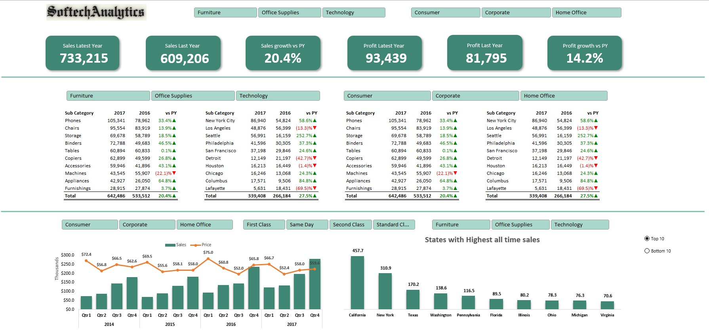

# 📊 Project Overview

 This Excel Portfolio Project demonstrates my skills in data cleaning, data analysis, visualization, and reporting using Microsoft Excel. The project involves comprehensive data manipulation and insightful visual presentations to support decision-making. 

## 📁 Dataset Description

 The project utilizes data contained in Excel_Portfolio_Project.xlsx. This dataset includes multiple data points relevant to the context, providing ample opportunities for data exploration and insights generation.

## 🛠️ Tools and Techniques
<ul>
<li>Excel Functions (VLOOKUP, INDEX-MATCH, IF Statements, etc.)</li>

<li>Pivot Tables and Pivot Charts</li>

<li>Conditional Formatting</li>

<li>Data Validation</li>

<li>Dashboards and Interactive Elements</li>

<li>Data Visualization (Charts, Graphs)</li>
</ul>
 🎯 Project Functionalities
<ul>
<li>Data Cleaning and Preprocessing:</li>

<li>Handling missing values</li>

<li>Removing duplicates</li>

<li>Formatting data consistently</li>
</ul>
Data Analysis:
<ul>
<li>Extracting actionable insights</li>

<li>Summarizing data effectively using pivot tables</li>

Visualization:

<li>Interactive Dashboards</li>

<li>Informative and clear graphical representations</li>
</ul>
Reporting:
<ul>
<li>Generating easy-to-interpret Excel reports</li>

<li>Summarizing key insights</li>
</ul>

📈 Key Insights and Findings

<em>Sales Growth:</em>

Sales increased significantly from $609,205.60 in 2016 to $733,215.26 in 2017, representing a 20.36% growth.

<em>Profit Growth:</em>

Total profit grew from $81,795.17 in 2016 to $93,439.27 in 2017, a 14.24% increase.

<em>Sales and Profit Performance:</em>

The total combined sales for the two years is $1,342,420.85, generating an overall profit of $175,234.44.

<em>Top Categories:</em>

Furniture and Office Supplies appear to be significant contributors to sales and profit. However, some items, such as certain furniture (e.g., tables), may incur losses, highlighting potential areas for optimization.

<em>Geographic Insights:</em>

The dataset includes transactions from various regions, indicating the importance of location-based insights for marketing or logistical improvements.

<em>Product and Discount Analysis:</em>

The presence of products with negative profits (e.g., heavy discounts like 45% on some furniture items resulting in losses) indicates opportunities to reassess pricing and discount strategies.

## 📊 Data Patterns and Trends:

<em> Increasing Sales Trend:</em>

 A clear upward sales trend was observed from 2016 to 2017 (20.36% growth), indicating a positive trajectory in business activities.

<em> Profitability Trend:</em>

Profits also increased year-over-year (14.24%), although the growth rate was lower than sales, suggesting rising operational or sales-related costs.

<em> Product Segment Performance:</em>

Furniture and Office Supplies demonstrated consistent sales volume, making them key product categories for revenue generation.

<em> Geographical Concentration:</em>

Sales transactions are primarily concentrated in major urban areas, such as Los Angeles and Henderson, indicating these are strategic locations for potential targeted marketing or logistics efficiency improvements.

## ⚠️ Anomalies and Opportunities:
<em> Loss-Making Products:</em>

Certain items (e.g., Furniture like Bretford CR4500 Tables) exhibited significant losses due to high discounting (45% discount resulted in negative profit). This suggests the need to revisit pricing or discount policies.

<em> Discount Strategy Concerns:</em>

Products sold at discounts above 20% frequently showed profit erosion or losses, highlighting potential inefficiencies in current discount strategies.

<em> Uneven Profit Margins:</em>

Despite overall growth, certain product lines and regions have disproportionately lower margins, indicating potential inefficiencies or hidden operational costs.

These insights can directly inform strategic business decisions related to pricing, marketing, and supply chain management.

## 📸 Project Screenshots

## 🚀 Getting Started

To explore the project:

Download or clone the repository.

Open the Excel file Excel_Portfolio_Project.xlsx.

Navigate through the sheets to explore data, pivot tables, dashboards, and visualizations.

## 📌 Future Improvements

### Data Visualization Enhancements

<Strong>Interactive Dashboards:</Strong>
<ul>
<li>Upgrade static visualizations to interactive dashboards using Power BI, Tableau, or Python (Streamlit or Dash).</li>

Integrate drill-down capabilities and filtering for user-friendly exploration.</li>
</ul>
<Strong>Geospatial Analysis:</Strong>
<ul>
<li>Utilize geographic mapping for location-based insights (ArcGIS, QGIS, Mapbox, or Folium).</li>

<li>Conduct spatial analysis to visualize regional or community-level trends.</li>
</ul>

Data Quality and Governance

<Strong>Data Quality Audits:</Strong>
<ul>
<li>Establish regular data validation processes to ensure accuracy and consistency.</li>

<li>Automate data profiling and anomaly detection.</li>
</ul>
<Strong>Data Governance Framework:</Strong>
<ul>
<li>Develop clear standards for data management, privacy, and compliance.</li>

<li>Document data dictionaries and standard operating procedures (SOPs).</li>

<li>Strategic and Operational Insights</li>
</ul>
<Strong>Impact Analysis:</Strong>
<ul>
<li>Evaluate the financial, operational, and social impacts of current projects or initiatives.</li>

<li>Conduct cost-benefit analyses to inform strategic decision-making.</li>
</ul>
<Strong>Benchmarking and Comparative Analysis:</Strong>
<ul>
<li>Compare organizational metrics against industry standards or best practices.</li>

<li>Identify performance gaps and suggest actionable improvements.</li>
</ul>
Reporting and Communication

<Strong>Enhanced Reporting Templates:</Strong>
<ul>
<li>Develop standardized templates for recurring reports and analytics.</li>

<li>Incorporate executive summary sections and key highlights for stakeholder presentations.</li>
</ul>
<Strong>Storytelling with Data:</Strong>
<ul>
<li>Implement techniques for clear storytelling, improving narrative-driven presentations to stakeholders.</li>

<li>Develop visual narratives to clearly communicate insights and recommendations.</li>
</ul>

Automation and Efficiency

<Strong>Report Automation:</Strong>
<ul>
<li>Automate recurring reports using Power BI, SQL Server Reporting Services (SSRS), or Python scripts.</li>

<li>Establish automated alert systems for monitoring key performance indicators (KPIs).</li>
</ul>
<Strong> Process Optimization:</Strong>
<ul>
<li>Analyze workflows and processes to identify bottlenecks or inefficiencies.</li>

<li>Leverage robotic process automation (RPA) tools for routine data handling tasks.</li>
</ul>
Capacity Building and Training
<Strong> Skills Development:</Strong>
<ul>
<li>Identify relevant training opportunities (data visualization, analytics tools, statistical modeling).</li>

<li>Provide internal workshops or tutorials on best practices in data analysis.</li>
</ul>
Collaboration and Stakeholder Engagement:
<ul>
<li>Foster regular discussions or workshops with stakeholders to align analytics with business goals.</li>

<li>Implement feedback loops for continuous improvement in analytical processes.</li>
</ul>
## 📬 Connect with Me

Feel free to reach out:

LinkedIn: https://www.linkedin.com/in/chukwuemekaanyakwu2409

GitHub: https://github.com/Softechanalytics

Email: chuks.isaac70@gmail.com

